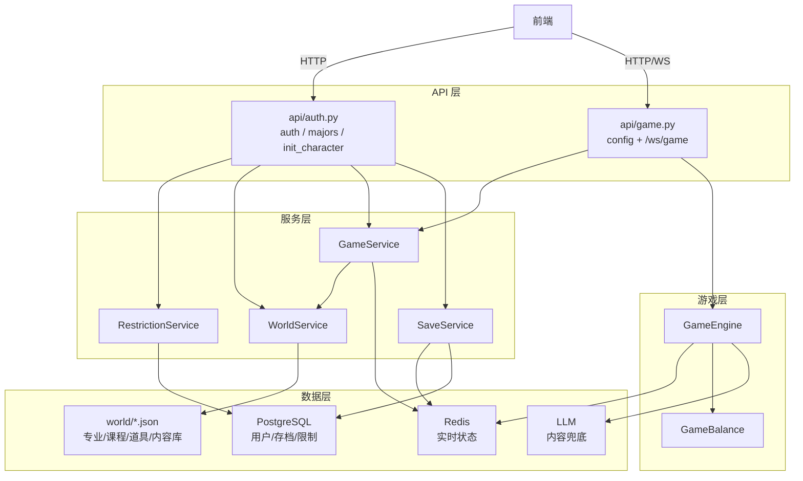
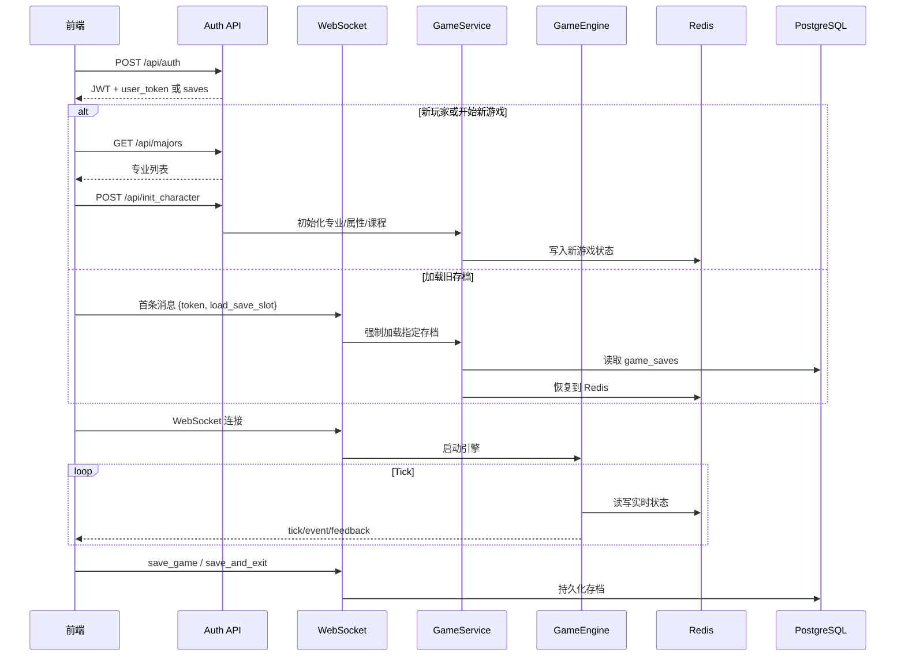

# ZJUers Simulator 后端项目结构与逻辑总览

> **项目概览**：一个基于 FastAPI + WebSocket + Redis + PostgreSQL 的校园模拟文字游戏后端。玩家通过邀请码认证，选择专业并初始化角色，再进入 WebSocket 驱动的 8 学期游戏循环。

---

## 目录结构

```text
zjus-backend/app/
├── main.py                  # FastAPI 入口，路由注册、启动事件
├── admin.py                 # SQLAdmin 后台管理面板
├── api/
│   ├── auth.py              # 邀请码认证、专业列表、角色初始化
│   ├── game.py              # WebSocket 游戏入口 + 配置 API
│   ├── deps.py              # DB/Redis/Service 依赖注入
│   └── cache.py             # Redis 连接与缓存工具
├── core/
│   ├── config.py            # 全局配置与安全检查
│   ├── database.py          # Async SQLAlchemy
│   ├── security.py          # JWT 创建
│   ├── events.py            # GameEvent 模型
│   └── llm.py               # LLM 内容生成
├── models/
│   ├── user.py              # User 表
│   ├── game_save.py         # GameSave 表
│   └── admin.py             # 限制、黑名单、审计表
├── schemas/
│   └── game_state.py        # PlayerStats / GameStateSnapshot
├── repositories/
│   └── redis_repo.py        # Redis 原子读写层
├── services/
│   ├── game_service.py      # 游戏生命周期编排
│   ├── save_service.py      # Redis ↔ PostgreSQL 存档同步
│   ├── world_service.py     # 专业/课程/成就 JSON 加载
│   ├── restriction_service.py
│   ├── balance_admin.py     # 后台数值配置表单、校验、发布
│   └── item_admin.py        # 后台道具配置表单、校验、发布
├── game/
│   ├── engine.py            # Tick 循环 + 动作处理
│   ├── balance.py           # 数值配置
│   ├── items.py             # 道具目录、经济与持有加成
│   ├── stat_definitions.py  # 属性定义注册表
│   └── state.py             # RedisState 兼容门面
└── websockets/
    └── manager.py           # 连接管理 + 心跳
```

---

## 核心架构



---

## 认证与角色初始化

### `POST /api/auth`

- 校验昵称、黑名单、邀请码。
- 新用户：创建 `User`，生成长期学生凭证 `user_token` 和 JWT。
- 老用户：校验长期学生凭证，返回 JWT 和 `SaveService.list_saves()` 的存档摘要。
- JWT payload 只包含 `sub` 和 `username`；不再包含考试档位。

### `GET /api/majors`

- 使用 `WorldService.get_all_majors()` 从 `world/majors.json` 拉平全部专业。
- 前端角色创建页用它展示专业卡片。

### `POST /api/init_character`

- 解 JWT，检查账号限制。
- 校验 `world/stat_definitions.json` 中 `allocatable=true` 的初始属性：
  - 当前默认配置为 `IQ` / `EQ` / `Luck` / `魅力`，每项 `50-150`。
  - 总和 `300`。
  - 推荐请求体使用 `stats` 映射；旧显式字段保留兼容。
- 调 `GameService.assign_major_and_init()` 初始化 Redis 状态。
- 专业 IQ 增益在服务层叠加，保留当前设计。

---

## 存档与进入游戏

### `SaveService`

| 方法 | 说明 |
|---|---|
| `persist_to_db(repo, db, save_slot=1)` | 将 Redis 快照 upsert 到 PostgreSQL |
| `load_from_db(user_id, repo, db, save_slot=1)` | 从 DB 指定槽位恢复到 Redis |
| `list_saves(user_id, db)` | 返回存档摘要给前端选择 |

当前 UI 支持展示存档列表；底层表已经按 `(user_id, save_slot)` 建唯一约束。

### WebSocket 加载逻辑

首条消息如果带 `load_save_slot`：

```json
{"token": "<JWT>", "load_save_slot": 1}
```

则 `GameService.prepare_game_context(..., force_load_save=True)` 会强制从 DB 指定槽位加载。若存档不存在，返回 `auth_error`。

不带 `load_save_slot` 时，优先使用 Redis 当前状态；Redis 不存在再尝试默认槽位 DB 存档。

---

## 游戏状态

### Redis Key

每个玩家 10 个核心 Key，均带 TTL：

- `player:{id}:stats`
- `player:{id}:courses`
- `player:{id}:course_states`
- `player:{id}:actions`
- `player:{id}:achievements`
- `player:{id}:event_history`
- `player:{id}:cooldowns`
- `player:{id}:current_event`
- `player:{id}:dingtalk_state`
- `player:{id}:items_state`

`RedisRepository` 负责字段归一化、批量写入、TTL 刷新、安全数值更新、钉钉私聊状态和道具背包状态读写。可归一化的数值属性来自 `stat_definitions.redis_int_fields`；`update_stat_safe()` 默认使用对应属性的 `min/max` 做 clamp，而不是统一写死 0-200。

### PlayerStats 初始值

`PlayerStats.build_initial()` 提供统一默认值，核心属性来自 `world/stat_definitions.json`：

- `energy` / `sanity` / `stress`
- `iq` / `eq` / `luck` / `charm`
- `reputation` / `efficiency` / `gold`
- `semester_idx=1`
- `semester="大一秋冬"`
- `gold` 由 `world/items.json` 的 `economy.initial_gold` 写入。

专业、课程和专业增益由 `GameService.assign_major_and_init()` 写入。

---

## 游戏引擎

`GameEngine` 负责：

- Tick 循环。
- 课程成长和精力消耗。
- 期末考试/GPA。
- 随机事件、CC98、钉钉消息。
- 钉钉联系人私聊、回复选项和三次回复一轮的数值结算。
- 道具购买、出售、持有加成和金币变化反馈。
- 休闲动作冷却计算、端点溢出转移和结果反馈弹窗消息。
- 内容生成模式切换：`library` / `hybrid` / `ai`。
- 学期推进、毕业、Game Over。

学期推进由 `GameService.process_semester_transition()` 编排。进入新学期时会重置课程和课程策略，并把精力向属性定义中的默认精力回调一半（`ceil((默认精力 + 当前精力) / 2)`），避免低精力跨学期直接形成不可恢复开局。

`api/game.py` 通过 `engine.start()` 启动单一主循环；`pause` 会停止 tick，`resume` 会重新启动。WebSocket 断开时调用 `engine.shutdown()` 取消主循环和仍在挂起的后台内容生成任务。

`_push_update()` 会在 `init` / `tick` 中带上 `relax_cooldowns`，前端据此锁定休闲按钮并显示剩余秒数。随机事件选择结果和休闲动作结果会同时通过 `event` 写入日志，并通过 `feedback` 推送弹窗：

- 随机事件结果：`auto_close_ms=5000`
- 休闲动作结果：`auto_close_ms=3000`

WebSocket 出站消息必须通过 `ConnectionManager.send_personal_message()`，同一用户的发送会被锁串行化，避免 `event_forwarder`、ping、保存结果等并发 `send_text`。`save_and_exit` 成功路径为 `save_result -> exit_confirmed -> 清 Redis -> close(1000)`。

暂停态只使用 `GameEngine.is_running`。当它为 `false` 时，后端会拒绝休闲、考试、事件选择、钉钉回复、道具买卖和课程策略变更；`next_semester` 仅在 Redis 中 `exam_completed=1` 后允许。

`game_balance.json` 的 `tick.interval_seconds` 是真实 tick 间隔，主循环 sleep 和 `elapsed_game_time` 增量都读取该值。

休闲动作的正向收益溢出只在 `_handle_relax()` 中处理：当精力/心态/魅力等正向收益或压力下降已经触及属性定义中的好端点时，最多把 20 点收益转移到精力、心态、魅力，且单次转移到魅力最多 +1。健身的魅力概率和数值由 `relax_actions.gym.charm_gain_probability` / `charm_gain` 控制。

常用动作：

| 动作 | 说明 |
|---|---|
| `start` / `pause` / `resume` | 控制引擎运行 |
| `set_speed` | 设置倍速 |
| `change_course_state` | 切换课程策略 |
| `relax` | 健身、游戏、散步、CC98 |
| `exam` | 期末考试 |
| `event_choice` | 随机事件选择 |
| `next_semester` | 进入下学期或毕业 |
| `set_mode` | 内容生成模式 |
| `item_buy` / `item_sell` | 购买或出售道具 |

---

## 道具与金币

道具数值来源为 `world/items.json`，由 `app/game/items.py` 加载、校验和生成前端可见目录。配置非法时道具目录降级为空并记录日志，避免阻断游戏启动。

- `economy.initial_gold` 控制新玩家初始金币。
- `economy.exam_income` 控制期末结算金币收入。
- `items[].effects` 只允许影响 `world/stat_definitions.json` 中 `allow_item_effect=true` 的属性。
- v1 每个 `item_id` 同一时间最多拥有一件；支持出售，`sell_price` 缺省为原价 50%。

道具为持有即生效的被动加成。基础属性仍保存在 Redis `stats` 中；`GameEngine` 读取时通过 `ItemCatalog.apply_bonuses_to_stats()` 生成 effective stats，并在推送给前端时附带 `item_bonuses`。这样保存、重登或出售不会造成加成重复写入。

背包状态保存在 Redis `player:{id}:items_state`，并随 `SaveService.persist_to_db()` 写入 `game_saves.items_data`。旧存档缺失 `items_data` 时按空背包加载，缺失 `gold` 时按 0 修复。

## 内容生成与检索

运行时内容系统为：

- 事件/CC98：优先本地预构建 JSON 库；库文件由 `scripts/generate_content_library.py` 通过 OpenAI-compatible `chat/completions` 离线生成，可接云端模型或本地 Ollama `/v1`。
- 钉钉：默认优先角色向量检索 + M2-her；玩家提供 `custom_rp_api_key` 时使用玩家 MiniMax key；玩家只提供通用自定义 LLM 时跳过平台默认 M2-her 并回退到通用 LLM。
- 钉钉私聊状态保存在 Redis，并随存档写入 `game_saves.dingtalk_data`；学期切换不会清空联系人或历史。
- 钉钉联系人由 `events.dingtalk.max_contacts` 限制，默认 12 位；新消息生成前只应用一次 `reuse_closed_contact_probability` 来决定是否复用已关闭轮次的联系人，复用选择偏向较久未活跃联系人；compact 时不能删除仍有打开轮次的联系人。
- 文言文结业总结：优先使用 LLM；算法模式或 LLM 不可用时，按最终累计 GPA 从 `world/graduation_comments.json` 选择毕业典礼兜底评价。

Docker 启动顺序：

```text
db -> migrate -> seed_embeddings -> backend
```

`seed_embeddings` 会把 `world/character_embeddings.csv` 导入 pgvector 表，保证后端启动后可检索角色。事件/CC98 文本库生成不再绑定某个文本模型客户端；Embedding 生成仍固定依赖本地 Ollama `bge-m3`。

---

## 运维后台与世界数据发布

SQLAdmin 挂载在 `/admin`，登录态与账号密码来自 `ADMIN_USERNAME`、`ADMIN_PASSWORD` 和 `ADMIN_SESSION_SECRET`。

`/admin/balance` 是专用数值平衡页面，只编辑运行中的 `world/game_balance.json` 既有结构，不进入 OpenAPI，也不需要数据库迁移。提交时由 `app/services/balance_admin.py` 将表单转换为完整配置、校验范围和固定节点，再用临时文件 + `os.replace` 原子写回；写回成功后调用 `GameBalance.reload()` 热重载。

`/admin/items` 是专用道具配置页面，编辑同一份 `world/items.json`。提交时由 `app/services/item_admin.py` 校验经济参数、道具 ID、价格、标签和 `allow_item_effect=true` 的被动效果字段，原子写回后调用 `items.reload()` 热重载。页面支持新增、修改和删除道具；已有道具 ID 保持只读，避免破坏旧存档背包中的 `item_id` 引用。

生产 Compose 保留 `./zjus-backend/world:/app/world` 挂载，因此后台保存会写到服务器挂载目录中的实际 `game_balance.json` / `items.json`。每次保存写入 `admin_audit_logs`：数值平衡为 `balance_update` / `balance_restore`，道具配置为 `items_update` / `items_restore`。后台页面的“恢复上一版”读取最近一次对应 update 审计记录中的完整旧配置，不是 Git 回滚。

---

## 数据库模型

- `users`：昵称、长期学生凭证、最高 GPA。
- `game_saves`：存档快照 JSON，含钉钉私聊状态和道具背包状态，按 `(user_id, save_slot)` 唯一。
- `user_restrictions`：账号限制。
- `user_blacklist`：黑名单，支持 username/token/ip。
- `admin_audit_logs`：后台操作审计。

入学考试相关的 `tier` / `exam_score` 字段已移除，迁移见 `20260528_0003_remove_exam_fields.py`。

---

## OpenAPI 与前端类型

后端 API 变更后，需要通过根目录 Docker Compose 启动服务，等待 `/openapi.json` 可访问，再生成前端类型：

```powershell
docker compose up -d --build backend
$openapi = $null
for ($i = 0; $i -lt 30; $i++) {
    try {
        $openapi = Invoke-WebRequest -UseBasicParsing http://127.0.0.1:8000/openapi.json
        if ($openapi.StatusCode -eq 200) { break }
    } catch {
        Start-Sleep -Seconds 2
    }
}
if (-not $openapi -or $openapi.StatusCode -ne 200) {
    throw "Backend did not serve /openapi.json in time."
}
cd zjus-frontend
.\node_modules\.bin\openapi-typescript.cmd http://127.0.0.1:8000/openapi.json -o src/types/api.generated.ts
```

`api.generated.ts` 是生成的契约类型来源，不手写修改；`client.ts` 是手写请求封装。

## 属性与世界数据校验

`world/stat_definitions.json` 是属性事实源。新增可分配属性、道具效果字段或事件效果字段时，先更新该文件，再运行：

```powershell
cd zjus-backend
..\.venv\Scripts\python.exe scripts\sync_stat_definitions.py --write
..\.venv\Scripts\python.exe scripts\validate_world_data.py
```

`sync_stat_definitions.py` 会生成前端属性元数据；`validate_world_data.py` 会检查属性定义、道具 effects、事件库 effects 和生成文件同步状态。需要新增属性模板时可先运行 `scripts\scaffold_game_stat.py add <stat_id>` 查看模板和复核清单。

更完整的数值、属性、道具和内容库维护流程见[游戏设定维护](/dev/world-data)。

---

## 玩家生命周期


