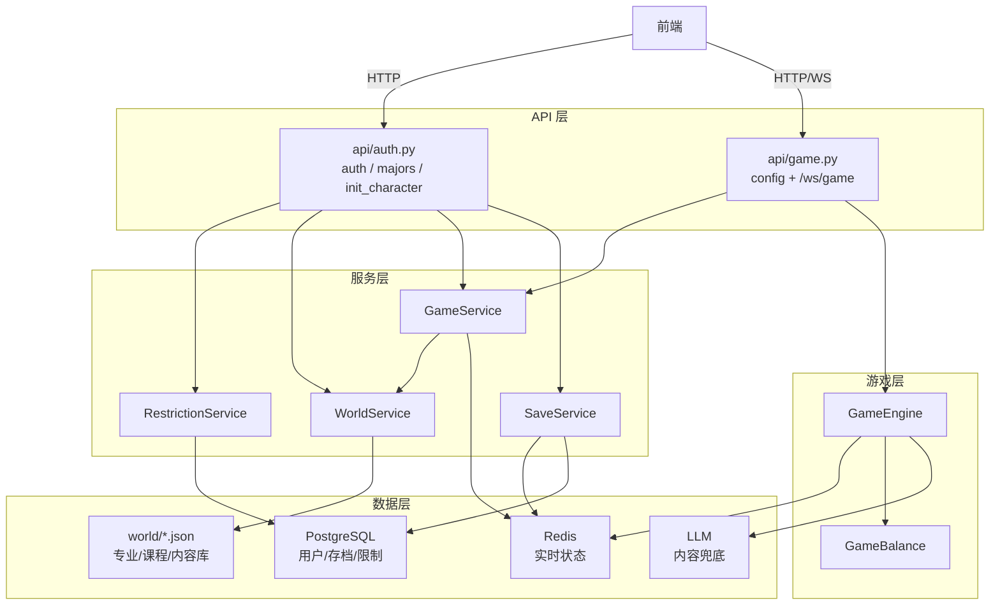
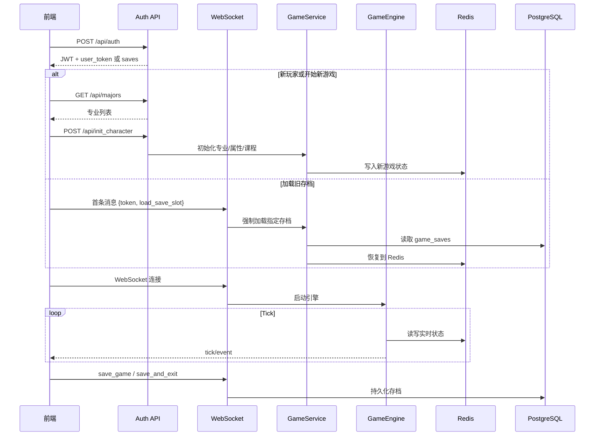

# ZJUers Simulator 后端项目结构与逻辑总览

> **项目概览**：一个基于 FastAPI + WebSocket + Redis + PostgreSQL 的校园模拟文字游戏后端。玩家通过邀请码认证，选择专业并初始化角色，再进入 WebSocket 驱动的 8 学期游戏循环。

---

## 目录结构

```text
zjus-backend/app/
├── main.py                  # FastAPI 入口，路由注册、启动事件
├── admin.py                 # SQLAdmin 后台管理面板
├── api/
│   ├── auth.py              # 邀请码认证、专业列表、角色初始化
│   ├── game.py              # WebSocket 游戏入口 + 配置 API
│   ├── deps.py              # DB/Redis/Service 依赖注入
│   └── cache.py             # Redis 连接与缓存工具
├── core/
│   ├── config.py            # 全局配置与安全检查
│   ├── database.py          # Async SQLAlchemy
│   ├── security.py          # JWT 创建
│   ├── events.py            # GameEvent 模型
│   └── llm.py               # LLM 内容生成
├── models/
│   ├── user.py              # User 表
│   ├── game_save.py         # GameSave 表
│   └── admin.py             # 限制、黑名单、审计表
├── schemas/
│   └── game_state.py        # PlayerStats / GameStateSnapshot
├── repositories/
│   └── redis_repo.py        # Redis 原子读写层
├── services/
│   ├── game_service.py      # 游戏生命周期编排
│   ├── save_service.py      # Redis ↔ PostgreSQL 存档同步
│   ├── world_service.py     # 专业/课程/成就 JSON 加载
│   └── restriction_service.py
├── game/
│   ├── engine.py            # Tick 循环 + 动作处理
│   ├── balance.py           # 数值配置
│   └── state.py             # RedisState 兼容门面
└── websockets/
    └── manager.py           # 连接管理 + 心跳
```

---

## 核心架构



---

## 认证与角色初始化

### `POST /api/auth`

- 校验昵称、黑名单、邀请码。
- 新用户：创建 `User`，生成长期学生凭证 `user_token` 和 JWT。
- 老用户：校验长期学生凭证，返回 JWT 和 `SaveService.list_saves()` 的存档摘要。
- JWT payload 只包含 `sub` 和 `username`；不再包含考试档位。

### `GET /api/majors`

- 使用 `WorldService.get_all_majors()` 从 `world/majors.json` 拉平全部专业。
- 前端角色创建页用它展示专业卡片。

### `POST /api/init_character`

- 解 JWT，检查账号限制。
- 校验 `IQ` / `EQ` / `Luck`：
  - 每项 `50-150`。
  - 总和 `250`。
- 调 `GameService.assign_major_and_init()` 初始化 Redis 状态。
- 专业 IQ 增益在服务层叠加，保留当前设计。

---

## 存档与进入游戏

### `SaveService`

| 方法 | 说明 |
|---|---|
| `persist_to_db(repo, db, save_slot=1)` | 将 Redis 快照 upsert 到 PostgreSQL |
| `load_from_db(user_id, repo, db, save_slot=1)` | 从 DB 指定槽位恢复到 Redis |
| `list_saves(user_id, db)` | 返回存档摘要给前端选择 |

当前 UI 支持展示存档列表；底层表已经按 `(user_id, save_slot)` 建唯一约束。

### WebSocket 加载逻辑

首条消息如果带 `load_save_slot`：

```json
{"token": "<JWT>", "load_save_slot": 1}
```

则 `GameService.prepare_game_context(..., force_load_save=True)` 会强制从 DB 指定槽位加载。若存档不存在，返回 `auth_error`。

不带 `load_save_slot` 时，优先使用 Redis 当前状态；Redis 不存在再尝试默认槽位 DB 存档。

---

## 游戏状态

### Redis Key

每个玩家 7 个核心 Key，均带 TTL：

- `player:{id}:stats`
- `player:{id}:courses`
- `player:{id}:course_states`
- `player:{id}:actions`
- `player:{id}:achievements`
- `player:{id}:event_history`
- `player:{id}:cooldowns`

`RedisRepository` 负责字段归一化、批量写入、TTL 刷新和安全数值更新。`efficiency`、`elapsed_game_time` 等运行时字段也在归一化层维护。

### PlayerStats 初始值

`PlayerStats.build_initial()` 提供统一默认值：

- `energy=100`
- `sanity=80`
- `iq=100`
- `eq=100`
- `luck=50`
- `semester_idx=1`
- `semester="大一秋冬"`

专业、课程和专业增益由 `GameService.assign_major_and_init()` 写入。

---

## 游戏引擎

`GameEngine` 负责：

- Tick 循环。
- 课程成长和精力消耗。
- 期末考试/GPA。
- 随机事件、CC98、钉钉消息。
- 内容生成模式切换：`library` / `hybrid` / `ai`。
- 学期推进、毕业、Game Over。

常用动作：

| 动作 | 说明 |
|---|---|
| `start` / `pause` / `resume` | 控制引擎运行 |
| `set_speed` | 设置倍速 |
| `change_course_state` | 切换课程策略 |
| `relax` | 健身、游戏、散步、CC98 |
| `exam` | 期末考试 |
| `event_choice` | 随机事件选择 |
| `next_semester` | 进入下学期或毕业 |
| `set_mode` | 内容生成模式 |

---

## 内容生成与检索

运行时内容系统为：

- 事件/CC98：优先本地预构建 JSON 库。
- 钉钉：优先角色向量检索 + M2-her；失败时回退通用 LLM。
- 文言文结业总结：仍使用 LLM。

Docker 启动顺序：

```text
db -> migrate -> seed_embeddings -> backend
```

`seed_embeddings` 会把 `world/character_embeddings.csv` 导入 pgvector 表，保证后端启动后可检索角色。

---

## 数据库模型

- `users`：昵称、长期学生凭证、自定义 LLM 配置、最高 GPA。
- `game_saves`：存档快照 JSON，按 `(user_id, save_slot)` 唯一。
- `user_restrictions`：账号限制。
- `user_blacklist`：黑名单，支持 username/token/ip。
- `admin_audit_logs`：后台操作审计。

入学考试相关的 `tier` / `exam_score` 字段已移除，迁移见 `20260528_0003_remove_exam_fields.py`。

---

## OpenAPI 与前端类型

后端 API 变更后，需要通过根目录 Docker Compose 启动服务，再生成前端类型：

```bash
docker compose up -d --build backend
cd zjus-frontend
npx openapi-typescript http://127.0.0.1:8000/openapi.json -o src/types/api.generated.ts
```

`api.generated.ts` 是契约类型来源；`client.ts` 是手写请求封装。

---

## 玩家生命周期


