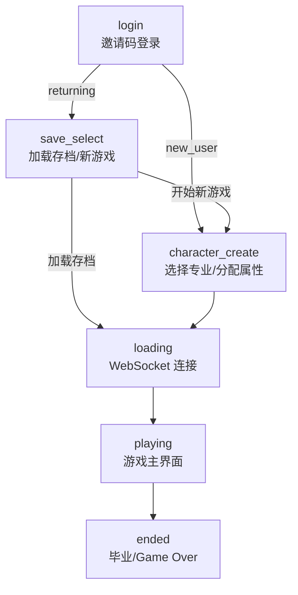

# ZJUers Simulator 前端项目结构与逻辑总览

> **项目概览**：基于 Vue 3 + Vite + Pinia 构建的单页应用。前端负责邀请码登录、存档选择、角色创建、实时游戏界面和结局展示，通过 WebSocket 与后端游戏引擎同步状态。

---

## 目录结构

```text
zjus-frontend/src/
├── App.vue                  # Phase 路由中枢 + 全局 Toast/反馈弹窗挂载
├── api/
│   └── client.ts            # HTTP API 薄封装，类型来自 OpenAPI
├── types/
│   ├── api.generated.ts     # 从后端 /openapi.json 生成
│   ├── game.ts              # GamePhase, PlayerStats
│   ├── course.ts            # 课程类型
│   ├── modal.ts             # 弹窗数据类型
│   └── websocket.ts         # WsMessage + 工具函数
├── stores/
│   └── gameStore.ts         # Pinia 全局状态
├── composables/
│   └── useGameWebSocket.ts  # WebSocket 连接、鉴权、消息分发
└── components/
    ├── LoginView.vue        # 邀请码登录 + 自定义 LLM 配置
    ├── SaveSelect.vue       # 老玩家存档选择 / 新游戏入口
    ├── CharacterCreate.vue  # 专业选择 + 初始属性分配
    ├── TopNav.vue           # 保存/退出
    ├── HudBar.vue           # 顶部属性栏
    ├── CourseList.vue       # 课程列表 + 策略切换
    ├── MidPanel.vue         # 事件日志 + 钉钉消息
    ├── RightPanel.vue       # 属性面板 + 摸鱼动作 + 内容模式
    ├── EndScreen.vue        # 结局界面
    └── modals/              # 成绩单、随机事件、反馈、退出确认
```

---

## Phase 流程

`GamePhase` 当前为：

```ts
login | save_select | character_create | loading | playing | ended
```



### `App.vue`

- 启动时读取 `localStorage`：
  - `zju_jwt` / `zju_token`：JWT，用于 HTTP/WS 鉴权。
  - `zju_user_token`：长期学生凭证，用于老玩家登录。
  - `zju_saves`：老玩家登录返回的存档摘要。
  - `game_started`：是否可以直接连接游戏。
  - `selected_save_slot`：选择加载的存档槽位。
- 当阶段进入 `loading` 时建立 WebSocket。
- 首次进入 `playing` 且 WebSocket 已连接后启动新手引导；引导期间通过 `pause` / `resume` 冻结后端 tick，并用 `isGuideActive` 冻结前端本地倒计时。
- 如果旧版本误把长期凭证写入 `zju_token`，启动时会迁移到 `zju_user_token` 并要求重新登录。

---

## HTTP API 层

### `api.generated.ts`

- 从后端 OpenAPI 自动生成。
- 作为后端契约类型来源。
- 不手写修改。

### `client.ts`

- 手写薄封装，负责 `fetch()` 调用。
- 类型别名引用 `components['schemas']`：
  - `AuthRequest` / `AuthResponse`
  - `SaveSummary`
  - `MajorOption`
  - `InitCharacterRequest` / `InitCharacterResponse`
  - `AdmissionInfoResponse`

主要函数：

| 函数 | 端点 | 用途 |
|---|---|---|
| `auth()` | `POST /api/auth` | 邀请码认证，新用户返回学生凭证，老用户返回存档列表 |
| `fetchMajors()` | `GET /api/majors` | 获取全部可选专业 |
| `initCharacter()` | `POST /api/init_character` | 创建新游戏角色 |
| `getAdmissionInfo()` | `GET /api/admission_info` | 兼容查询入学信息/学生凭证 |

---

## 关键组件

### `LoginView.vue`

- 表单字段：昵称、邀请码、老玩家学生凭证。
- 可选自定义 LLM 配置，用户确认安全提示后保存到 `sessionStorage`。
- 新玩家成功后：
  - 保存 JWT 到 `zju_token` / `zju_jwt`。
  - 保存长期学生凭证到 `zju_user_token`。
  - 进入 `character_create`。
- 老玩家成功后：
  - 保存 JWT 和存档摘要。
  - 清除 `game_started` / `selected_save_slot`。
  - 进入 `save_select`。

### `SaveSelect.vue`

- 从 `localStorage.zju_saves` 读取存档摘要。
- 加载存档：写入 `selected_save_slot`，设置 `game_started=1`，进入 `loading`。
- 开始新游戏：清除 `selected_save_slot` / `game_started`，进入 `character_create`。

### `CharacterCreate.vue`

- 调 `fetchMajors()` 展示专业。
- `IQ` / `EQ` / `Luck` 三个 slider：
  - 每项范围 50-150。
  - 总和必须等于 250。
- 调 `initCharacter()` 后设置 `game_started=1` 并进入 `loading`。

### `RightPanel.vue`

- 渲染学习效率、休闲动作、学期倒计时、期末考试和内容生成模式。
- 从 `gameStore.relaxCooldowns` 读取 `gym` / `game` / `walk` / `cc98` 剩余冷却。
- 冷却中或暂停时锁定休闲按钮；冷却中按钮文案显示剩余秒数。
- 本地倒计时只在 `!isPaused && !isGuideActive && currentPhase === 'playing'` 时流逝，后端 `semester_time_left` 到达时会校准。

### `FeedbackModal.vue`

- 展示服务端 `feedback` 消息。
- 随机事件结果默认 5 秒自动关闭；休闲动作结果默认 3 秒自动关闭。
- 用户可以点击按钮、关闭图标或背景手动关闭。

### `useGameWebSocket.ts`

WebSocket 首条消息包含：

```ts
{
  token,
  load_save_slot?,
  custom_llm_provider?,
  custom_llm_model?,
  custom_llm_api_key?
}
```

- `auth_ok` 后只启动心跳并记录连接日志；后端负责启动引擎，避免自动 `resume` 干扰引导或暂停。
- `auth_error` 会清理当前游戏标记；若是存档错误则回到 `save_select`，否则回到 `login`。
- `init` 将阶段切到 `playing` 并初始化课程、属性、剩余时间和 `relax_cooldowns`。
- `tick` 持续同步课程、属性、剩余时间和 `relax_cooldowns`。
- `feedback` 调用 `gameStore.showFeedback()` 展示结果弹窗。
- `save_result` / `exit_confirmed` 负责退出时清理 JWT 和本局标记。

---

## 状态管理

`gameStore.ts` 管理：

| 状态 | 说明 |
|---|---|
| `currentPhase` | 当前页面阶段 |
| `currentStats` | 玩家属性 |
| `courseMetadata` | 当前学期课程元数据 |
| `currentCourseStates` | 课程策略 |
| `semesterTimeLeft` | 学期剩余秒数 |
| `isPaused` / `isGuideActive` | 后端暂停状态 / 前端引导冻结状态 |
| `relaxCooldowns` | 休闲动作剩余冷却秒数 |
| `eventLogs` | 事件日志 |
| `dingMessages` | 钉钉消息 |
| `gameMode` / `llmAvailable` | 内容生成模式状态 |
| `activeModal` / `modalData` | 当前弹窗 |
| `feedbackModal` | 结果反馈弹窗 |
| `endType` / `endData` | 结局数据 |

---

## 开发命令

```bash
npm run dev
npm run build
npm run type-check
npm run lint
npm test
```

OpenAPI 类型生成需在根目录通过 Docker Compose 启动后端后执行：

```bash
docker compose up -d --build backend
cd zjus-frontend
npx openapi-typescript http://127.0.0.1:8000/openapi.json -o src/types/api.generated.ts
```
