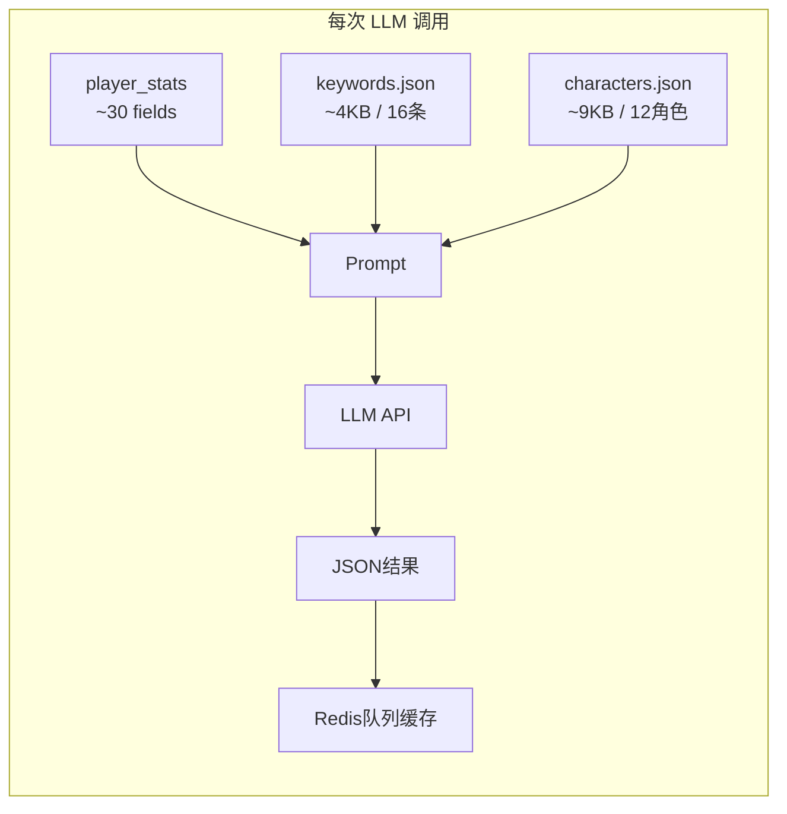
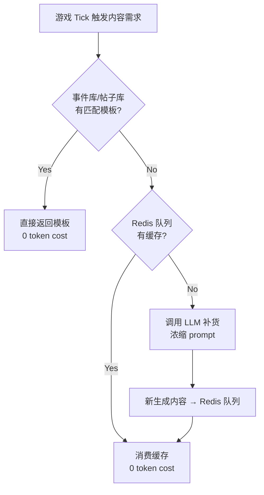
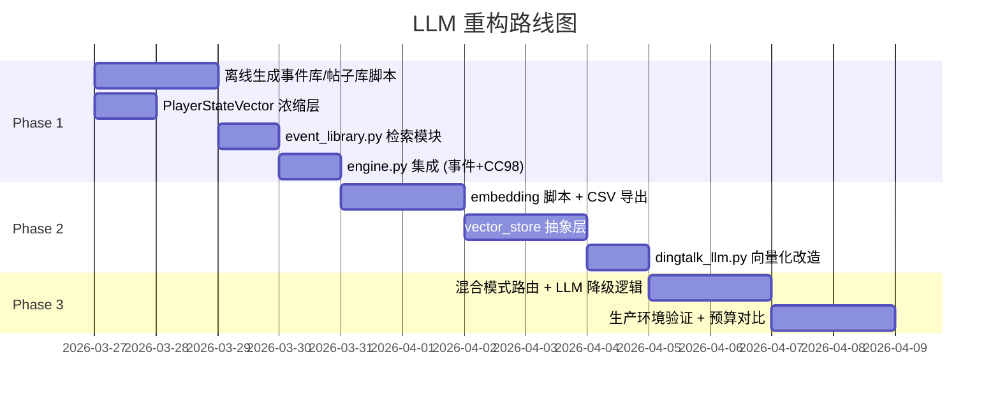

# LLM 层重构方案：向量化 + 事件库 + 模式匹配

## 1. 现状分析

### 当前架构（全量投喂模式）



**Token 消耗明细（每次调用）**：

| 模块 | System Prompt | User Prompt | Output | Total/call |
|---|---|---|---|---|
| CC98 帖子 | keywords ~800 tok | stats+trigger ~300 tok | 5条 ~200 tok | ~1300 |
| 随机事件 | keywords ~800 tok | stats+history ~400 tok | 3事件 ~600 tok | ~1800 |
| 钉钉 (fallback) | characters ~2000 tok | stats+context ~300 tok | 5条 ~300 tok | ~2600 |
| 钉钉 (M2-her) | char+examples ~300 tok | player desc ~100 tok | 1条 ~100 tok | ~500 ×3并发 |
| 文言结业 | keywords ~800 tok | final_stats ~300 tok | ~200 tok | ~1300 |

> **核心问题**：`characters.json` 和 `keywords.json` 整体注入每个 prompt，但实际只需 1-3 条相关条目。且 world 设定集将来会扩大为 100KB+ 级别。

### 已有优化（保留）

- ✅ Redis 批量队列 (batch-then-cache) — 1 次调用生成 3-5 条，后续从队列消费
- ✅ M2-her 对钉钉的单角色精准注入（`dingtalk_llm.py` 已实现按 context 加权选角色）
- ✅ `cache_control: ephemeral` 标记尝试利用 API 层 prompt caching

---

## 2. 重构目标

```
Token 消耗降低 70-80%，同时支持 world 设定集横向扩展至 100KB+
```

### 核心策略

| 策略 | 适用模块 | 原理 |
|---|---|---|
| **预编译事件库** | 随机事件、CC98 | 本地预生成数百条模板，运行时按玩家状态检索 |
| **向量化选角** | 钉钉消息 | 将角色 embedding 化，按状态向量余弦相似度选 Top-K |
| **状态摘要浓缩** | 所有模块 | 只发 3-5 个关键状态维度，不发完整 stats |
| **LLM 降级为补货** | 全部 | 模板/向量库优先，队列耗尽时才调用 LLM 补货 |

---

## 3. 分阶段实施方案

### Phase 1: 预编译事件库 + 状态浓缩（优先级最高）

> 目标：随机事件和 CC98 完全脱离实时 LLM 调用

#### 3.1.1 预编译事件库

**离线生成**：用 LLM 一次性批量生成 200-500 条事件模板，按标签分类存入 JSON/CSV：

```json
// world/event_library.json
[
  {
    "id": "evt_001",
    "title": "室友打呼噜",
    "desc": "凌晨3点，你被室友的呼噜声吵醒...",
    "tags": ["生活", "寝室", "搞笑"],
    "mood_range": [0, 100],
    "stress_range": [0, 50],
    "options": [
      {"id": "A", "text": "戴耳塞继续睡", "effects": {"energy": 3, "desc": "..."}},
      {"id": "B", "text": "录下来发CC98", "effects": {"sanity": 5, "desc": "..."}}
    ]
  }
]
```

**运行时检索**：

```python
def match_events(player_state: PlayerStateVector, library: List[Event], k=1) -> List[Event]:
    """按玩家状态向量匹配最佳事件"""
    candidates = [
        e for e in library
        if e.mood_range[0] <= player_state.sanity <= e.mood_range[1]
        and e.stress_range[0] <= player_state.stress <= e.stress_range[1]
        and e.id not in player_state.seen_events  # 去重
    ]
    return random.sample(candidates, min(k, len(candidates)))
```

**CC98 帖子库**同理：预生成 300+ 帖子模板，按 `effect` (positive/neutral/negative) + `trigger` 标签匹配。

#### [NEW] `app/content/event_library.py` — 事件库加载与检索
#### [NEW] `world/event_library.json` — 预编译事件库（离线 LLM 生成）
#### [NEW] `world/cc98_library.json` — 预编译 CC98 帖子库
#### [NEW] `scripts/generate_content_library.py` — 离线批量生成脚本

#### 3.1.2 状态浓缩

将完整 `player_stats`（30+ 字段）浓缩为 5 维状态向量：

```python
@dataclass
class PlayerStateVector:
    mood: str          # "高昂" | "正常" | "低落" | "崩溃"
    stress_level: str  # "轻松" | "适中" | "高压" | "爆表"
    academic: str      # "学霸" | "普通" | "挂科边缘"
    semester: str      # "大一秋冬"
    major: str         # "计算机科学与技术"

    @classmethod
    def from_stats(cls, stats: dict) -> "PlayerStateVector":
        sanity = int(stats.get("sanity", 50))
        stress = int(stats.get("stress", 0))
        gpa = float(stats.get("gpa", 0))

        mood = "崩溃" if sanity < 20 else "低落" if sanity < 40 else "正常" if sanity < 80 else "高昂"
        stress_level = "爆表" if stress > 80 else "高压" if stress > 50 else "适中" if stress > 20 else "轻松"
        academic = "学霸" if gpa >= 3.8 else "挂科边缘" if gpa < 2.0 and gpa > 0 else "普通"

        return cls(mood=mood, stress_level=stress_level, academic=academic,
                   semester=stats.get("semester", ""), major=stats.get("major", ""))
```

LLM 补货时只传浓缩摘要（~50 token），不传完整 stats（~300 token）。

---

### Phase 2: 向量化角色检索（钉钉消息优化）

> 目标：characters.json 扩展到 50+ 角色时仍能精准选角

钉钉的 M2-her 模块 (`dingtalk_llm.py`) 已经实现了按 context 加权选角色。重构方向是将 **硬编码权重** 替换为 **向量化相似度检索**。

#### 3.2.1 角色 Embedding

```python
# 离线：对每个角色的 content + examples 生成 embedding
for char in characters:
    text = f"{char['name']} {char['content']} {' '.join(char['examples'])}"
    char['embedding'] = embedding_model.encode(text)  # float[768]
```

#### 3.2.2 运行时检索

```python
async def select_character(state_vector: PlayerStateVector, k=1) -> List[Character]:
    """向量化角色选取：将玩家状态映射为查询向量，检索最匹配的角色"""
    query_text = f"{state_vector.mood} {state_vector.stress_level} {state_vector.semester}"
    query_vec = embedding_model.encode(query_text)

    # pgvector: SELECT * FROM characters ORDER BY embedding <=> $1 LIMIT $2
    # 或 FAISS 本地索引（开发环境更轻量）
    results = await vector_store.search(query_vec, top_k=k)
    return results
```

#### 存储选项

| 方案 | 适用场景 | 优缺点 |
|---|---|---|
| **pgvector** (asyncpg) | 全环境 ✅ | Docker 部署送零依赖，与现有 PG 集成 |

#### [NEW] `app/content/vector_store.py` — 向量存储抽象层 (pgvector / FAISS)
#### [NEW] `scripts/embed_world_data.py` — 离线 embedding 生成 + CSV 导出
#### [MODIFY] `dingtalk_llm.py` — 替换硬编码权重为向量检索

---

### Phase 3: 混合模式（模板优先 + LLM 补货）



**预期效果**：

| 场景 | 当前 Token/次 | 重构后 Token/次 | 降幅 |
|---|---|---|---|
| 随机事件 | ~1800 | 0（模板匹配）/ ~400（LLM 补货） | **80-100%** |
| CC98 帖子 | ~1300 | 0（模板匹配）/ ~300（LLM 补货） | **80-100%** |
| 钉钉消息 | ~2600 / ~1500 | ~600（向量选角 + 浓缩状态） | **60-75%** |
| 文言结业 | ~1300 | ~500（浓缩状态，保留 LLM） | **60%** |

---

## 4. 实施路线图



---

## 5. 技术决策（已确认）

| 决策项 | 选型 | 说明 |
|---|---|---|
| Embedding 模型 | **bge-m3** via Ollama | 本地零成本，`ollama pull bge-m3` 即可 |
| 向量存储 | **pgvector** | Docker 环境下全环境统一使用 |
| 离线内容生成 | **qwen3.5:4B-Q4_K_M** via Ollama | `scripts/` 下脚本，`think=False` 禁用思考模式 |
| 文言结业 | 保留纯 LLM | 一次性调用，需要个性化 |
